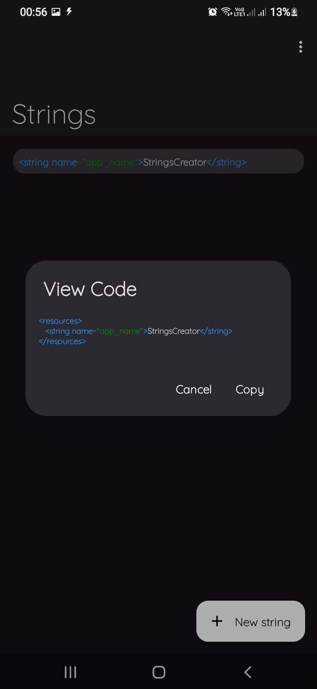

# Strings-Creator 

 
    
Quick, Easy and practical! 

        
    
        <a href="https://github.com/aquilesTrindade/StringsCreator/releases">
        

# What's is Strings-Creator? 

    
    
    

#

<b>Strings-Creator</b> is a application for android, to facilitate your life to Create Xml Strings

You only need to type Name and Value of string and Done!

your xml strings file is ready!
