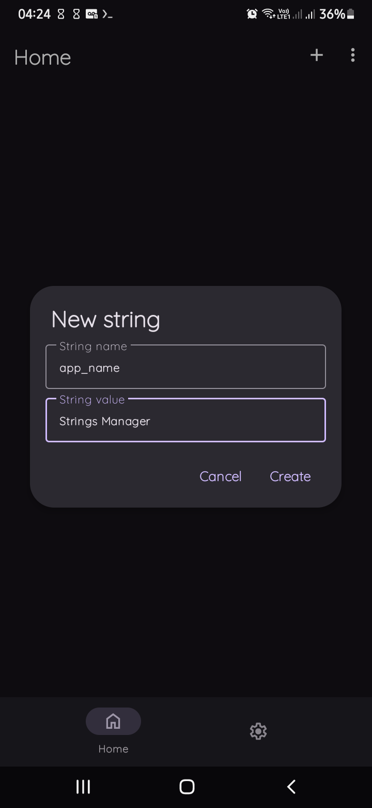
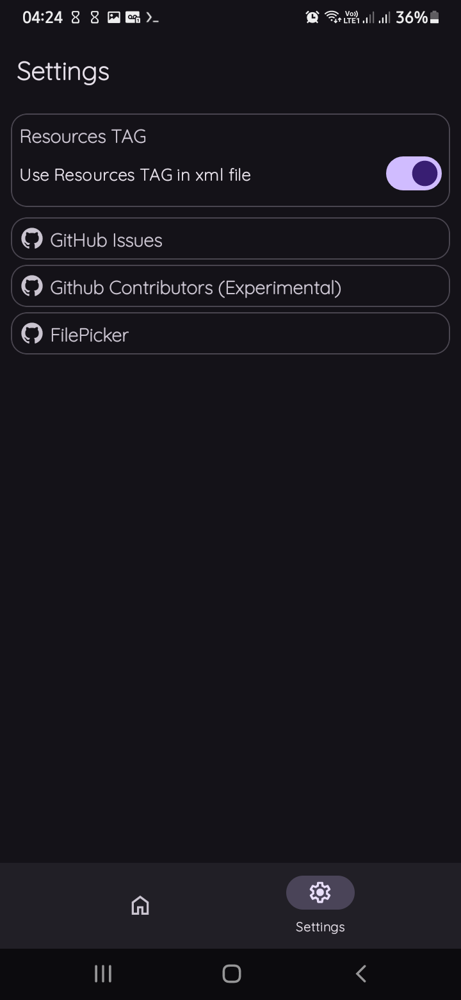

# Strings-Manager

 
    
Quick, Easy and practical! 

    
        
    
        <a href="https://github.com/aquilesTrindade/StringsManager/releases">
        
                
    

# What's is Strings-Manager? 

    
    
    

#

<b>Strings-Manager</b> is a application for android, to facilitate your life to Create Xml Strings

You only need to type Name and Value of string and Done!

your xml strings file is ready!

# Download 

# Contributors:

